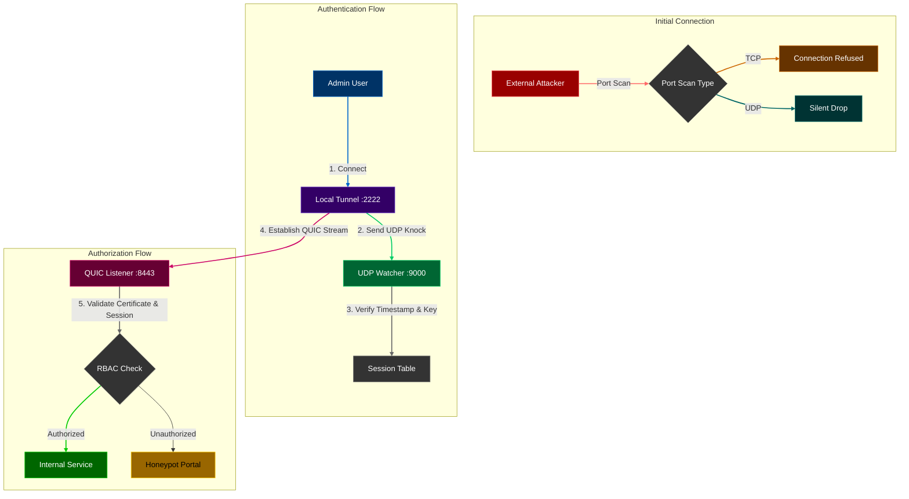

# GhostPort
> **Zero-Trust Stealth Bunker**\
> **Current Version:** v5.1 (Stealth Bunker + Security Hardening)\
> **Status:** Production-Ready Core\
> **Language:** Rust


## Overview
**GhostPort** has evolved from a security-hardened reverse proxy into a dedicated **Stealth Bunker** for critical infrastructure. 

While earlier versions (v1-v3) aimed to be a "Better Nginx" with security features, **v5.0** represents a strategic pivot. We are no longer a general-purpose web server. GhostPort is now a specialized, invisible gateway designed solely to protect high-value internal services (SSH, RDP, Kubernetes APIs, Admin Panels) from the public internet.

In **v5.1**, we hardened this bunker with **Certificate Pinning** and **Replay Protection** to ensure it withstands advanced network attacks.

---

## Architecture (v5.1)



---

## Version History & Changelog

### **v5.1: Security Hardening (Current)**
*   **Security:** **Certificate Pinning**. The Client now requires the Server's Certificate Hash (`--server-cert-hash`) to prevent MITM attacks on the QUIC tunnel.
*   **Security:** **Timestamp Replay Protection**. The Noise Handshake now includes a signed timestamp. Packets older than 30 seconds are rejected.
*   **Quality:** **Comprehensive Test Suite**. Added Unit, Integration, and End-to-End System tests covering all critical paths.

### **v5.0: The Stealth Bunker**
*   **Protocol Migration (TCP &rarr; UDP):** Replaced `tokio::net::TcpListener` with `quinn` (QUIC). The Data Plane is now entirely UDP-based.
*   **New Feature: Local Tunneling:** Introduced `ghostport connect` CLI to bridge local TCP traffic into the remote QUIC stream.
*   **New Feature: Anti-Lockout Watchdog:** Added `scripts/watchdog.sh`. If the GhostPort binary crashes >3 times, it automatically opens standard SSH (Port 22) via UFW/Iptables to prevent admin lockout.
*   **Removed Feature:** **Public Routes**. All routes are now strictly private.

### **v4.0: The Crypto-Identity Edition**
*   **Major Overhaul:** Replaced the TOTP/String-based auth system with the **Noise Protocol**.
*   **Feature: Mutual Authentication:** Both Server and Client verify each other's static public keys.
*   **Feature: Encrypted Configuration:** The Server's Private Key is stored as an encrypted Base64 blob.

### **v3.0: Identity & Access Management (IAM)**
*   **Feature: RBAC (Role-Based Access Control):** Users are assigned roles, and paths enforce role requirements.
*   **Feature: TOTP Integration:** Replaced static passwords with Time-based One-Time Passwords.

### **v2.1: The Hardened Edition**
*   **Feature: The Jailkeeper:** An active defense system. 3 Strikes = 1 Hour IP Ban.
*   **Feature: DoS Protection:** Slowloris timeouts and Semaphore connection limits.

### **v2.0: The Security Gateway**
*   **Feature: Single Packet Authorization (SPA):** The first implementation of the "Knock".
*   **Feature: Honeypot:** First implementation of the deception module.

### **v1.0: The Prototype**
*   **Core:** Basic TCP Proxying.

---

## How to Run

### Prerequisites
1.  **Rust Toolchain:** `curl --proto '=https' --tlsv1.2 -sSf https://sh.rustup.rs | sh`
2.  **Generate Certs:** `openssl req -x509 -newkey rsa:4096 -keyout key.pem -out cert.pem -days 365 -nodes`

### 1. Build
```bash
car go build --release
```

### 2. Generate Identities
```bash
# Server Key (Encrypted)
car go run -- keygen --master-key "my_secret"

# Client Key (Raw)
car go run -- keygen --master-key "temp"
```

### 3. Start Server
```bash
export GHOSTPORT_MASTER_KEY="my_secret"
./scripts/watchdog.sh
# COPY THE CERTIFICATE HASH PRINTED IN THE LOGS!
```

### 4. Connect (Client Tunnel)
```bash
car go run -- connect \
  --target "1.2.3.4:8443" \
  --knock "1.2.3.4:9000" \
  --local-port 2222 \
  --server-pub "<SERVER_PUB_KEY>" \
  --my-priv "<CLIENT_PRIV_KEY>" \
  --server-cert-hash "<HASH_FROM_STEP_3>"
```

### 5. Access
```bash
ssh -p 2222 user@localhost
```

---

## Configuration (`GhostPort.toml`)
All rules are **Private**.

```toml
[server]
listen_ip = "0.0.0.0"
listen_port = 8443
tls_enabled = true
cert_path = "./certs/server.crt"
key_path = "./certs/server.key"

[backend]
target_addr = "127.0.0.1:22"
target_host = "localhost"

[security]
encrypted_private_key = "..." 

[[users]]
username = "admin"
roles = ["superadmin"]
public_key = "..."

[[rules]]
path = "/"
allowed_roles = ["superadmin"]
on_fail = "honeypot"
```
