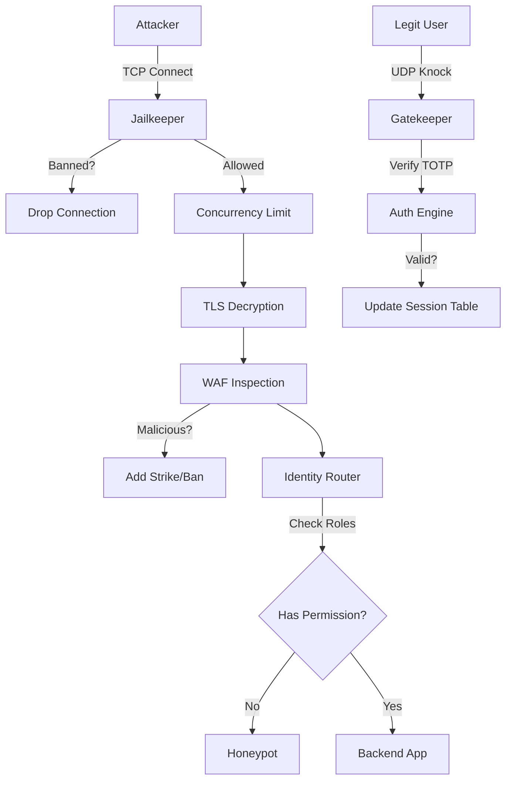

# GhostPort
> **Zero-Trust Identity Aware Proxy**\
> **Current Version:** v3.0 (Identity Access Management Edition)\
> **Status:** Production-Ready Core / Pre-UI\
> **Language:** Rust


## Overview
**GhostPort** is a high-performance, security-focused Reverse Proxy designed to protect internal services from the public internet. Unlike standard proxies (Nginx/HAProxy), GhostPort operates on a **Zero-Trust** model. It assumes all traffic is hostile until proven otherwise.

It combines the features of a **Firewall** (SPA/Port Knocking), a **WAF** (Web Application Firewall), an **IDS** (Intrusion Detection/Honeypot), and an **IAM** (Identity Access Management) system into a single, dependency-free binary.


---

## Architecture (v3.0)
GhostPort operates using a "Defense in Depth" pipeline. Traffic must pass through multiple security layers before reaching the backend.



### Key Modules*
**`src/main.rs`**: The Orchestrator. Manages the TCP/UDP threads and shared state.
* **`src/auth.rs`**: **(New in v3.0)** The Identity Engine. Handles TOTP verification (`HMAC-SHA1`) and prevents Replay Attacks via a "Burnt Code" cache.
* **`src/jail.rs`**: **(New in v2.1)** Active Defense. Instantly drops connections from banned IPs before they consume resources.
* **`src/router.rs`**: Role-Based Access Control (RBAC). Checks if the authenticated user has the required roles (e.g., `["admin"]`) for the requested path.
* **`src/waf.rs`**: Regex-based inspection engine to block SQLi, XSS, and Traversal attacks.
* **`src/udp.rs`**: The SPA listener. Parses `User:TOTP` packets to authorize sessions.
* **`src/honeypot.rs`**: Interactive deception module. Serves fake login pages to capture attacker credentials and monitor attackers.

---

## Version History & Changelog
### **v3.0: Identity & Access Management (Current)**
* **Feature:** **TOTP Integration**. Static passwords replaced with Time-based One-Time Passwords.
* **Feature:** **Replay Protection**. Codes are "burned" immediately after use. Sniffing a packet is now useless to an attacker.
* **Feature:** **RBAC (Role-Based Access Control)**. Users have multiple roles (e.g., `dev`, `admin`). Endpoints enforce specific role requirements.
* **Logic:** Moved from "IP-based Trust" to "Identity-based Trust".

### **v2.1: The Hardened Edition**
* **Feature:** **The Jailkeeper**. An active ban system. 3 Strikes = 1 Hour Ban (default numbers).
* **Feature:** **DoS Protection**.
* **Slowloris:** Enforced 5-second timeouts on HTTP headers.
* **Connection Floods:** Added Semaphore to limit max concurrent connections (Default: 1000).


* **Fix:** WAF now URL-decodes payloads (handling `%27` vs `'`) before inspection.

### **v2.0: The Security Gateway**
* **Feature:** **Single Packet Authorization (SPA)**. Services are invisible until a UDP packet is received.
* **Feature:** **Configuration System**. Added `GhostPort.toml` for hot-swappable settings.
* **Feature:** **Honeypot**. First implementation of the fake admin panel.
* **Feature:** **Webhooks**. Integration with Discord/Slack for real-time alerts.

### **v1.0: The Prototype**
* **Feature:** Basic TCP Proxying using `tokio::io::copy_bidirectional`.
* **Feature:** HTTP Header Parsing.
* **Feature:** Host Header Spoofing (Virtual Host routing).

---

## Configuration (`GhostPort.toml`)
The system is fully driven by this configuration file.

```toml
[server]
listen_ip = "0.0.0.0"
listen_port = 8443
tls_enabled = true
cert_path = "./certs/server.crt"
key_path = "./certs/server.key"

[security]
auth_mode = "user_totp"
replay_window = 90      # Seconds to keep used codes in memory
max_strikes = 3         # Strikes before ban
ban_duration = 3600     # Ban time in seconds

# --- IDENTITY MANAGEMENT ---

[[users]]
username = "user_admin"
roles = ["superadmin", "dev"]
# Base32 Secret for TOTP (Use an app to scan this)
secret = "JBSWY3DPEHPK3PXP" 

[[users]]
username = "guest_auditor"
roles = ["auditor"]
secret = "KBSWY3DPEHPK3PXP"

# --- ROUTING RULES ---

# Public Area
[[rules]]
path = "/"
type = "public"
strict_waf = true

# Protected Admin Panel (Requires 'superadmin' role)
[[rules]]
path = "/admin"
type = "private"
allowed_roles = ["superadmin"]
on_fail = "honeypot" 

# Logs (Requires 'auditor' OR 'superadmin')
[[rules]]
path = "/logs"
type = "private"
allowed_roles = ["auditor", "superadmin"]
on_fail = "block"

```

---

## How to Run
### Prerequisites
1. **Rust Toolchain:** `curl --proto '=https' --tlsv1.2 -sSf https://sh.rustup.rs | sh`
2. **Generate Certs (Local):**
```bash
openssl req -x509 -newkey rsa:4096 -keyout key.pem -out cert.pem -days 365 -nodes

```


### Running the Server
```bash
# 1. Start your backend (e.g., a python server)
python3 -m http.server 8080 &

# 2. Run GhostPort
cargo run --release

```

### Authenticating (The "Knock")
Since v3.0 uses TOTP, you cannot just send a static string. You must generate a code.

**Option A: Python Helper Script**

```python
import pyotp
import socket

# Your Secret from config
totp = pyotp.TOTP("JBSWY3DPEHPK3PXP") 
code = totp.now()
payload = f"user_admin:{code}"

sock = socket.socket(socket.AF_INET, socket.SOCK_DGRAM)
sock.sendto(payload.encode(), ("127.0.0.1", 9000))
print(f"Sent Knock: {payload}")

```

**Option B: Manual (If you are fast!)**
Use Google Authenticator with the secret `JBSWY3DPEHPK3PXP`.

```bash
# Replace 123456 with your current code
echo -n "user_admin:123456" | nc -u -w 1 127.0.0.1 9000

```

---

## Future Roadmap
* **Phase 6 (Next):** **"Mission Control" Dashboard**. A TUI (Terminal User Interface) built with `ratatui` to visualize active sessions, banned IPs, and live attacks in real-time.
* **Phase 7:** Distributed State (Redis) for multi-server clusters.
* **Phase 8:** ACME Integration (Auto-Let's Encrypt).