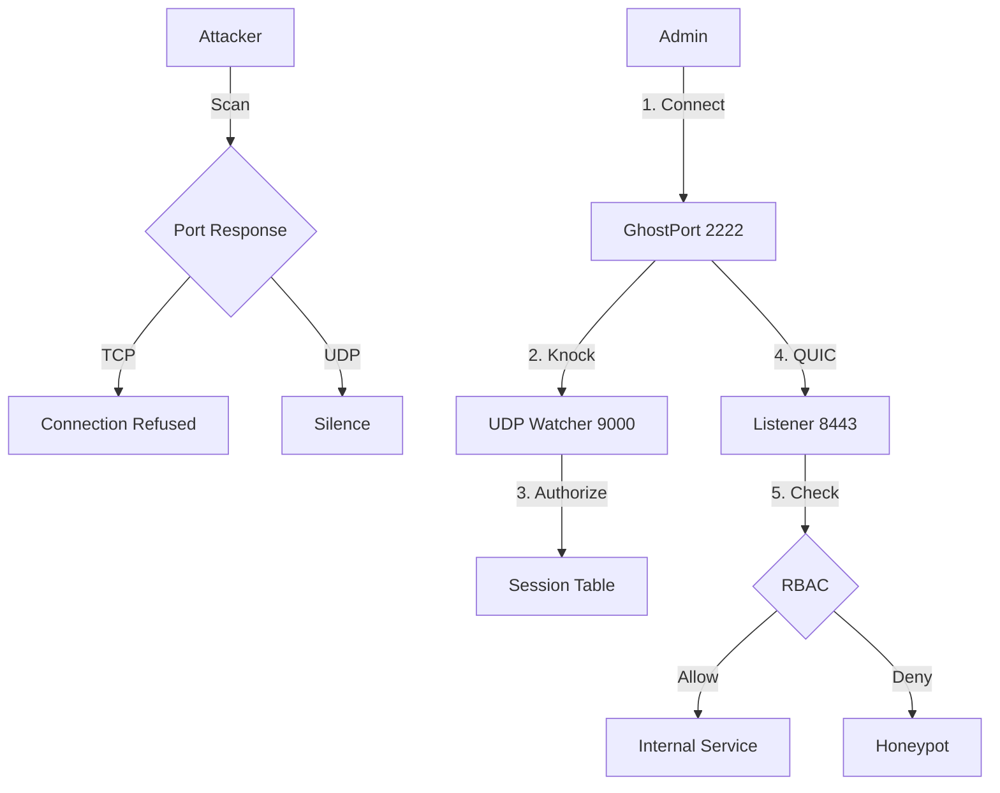

# GhostPort
> **Zero-Trust Stealth Bunker**\
> **Current Version:** v5.0 (Stealth Bunker)\
> **Status:** Production-Ready Core\
> **Language:** Rust


## Overview
**GhostPort** has evolved from a security-hardened reverse proxy into a dedicated **Stealth Bunker** for critical infrastructure. 

While earlier versions (v1-v3) aimed to be a "Better Nginx" with security features, **v5.0** represents a strategic pivot. We are no longer a general-purpose web server. GhostPort is now a specialized, invisible gateway designed solely to protect high-value internal services (SSH, RDP, Kubernetes APIs, Admin Panels) from the public internet.

It combines the features of a **Firewall** (SPA/Port Knocking), a **WAF** (Web Application Firewall), an **IDS** (Intrusion Detection/Honeypot), and an **IAM** (Identity Access Management) system into a single, dependency-free binary that communicates exclusively over encrypted UDP tunnels.

---

## The Paradigm Shift: v4.0 &rarr; v5.0
In **v5.0**, we made radical changes to the core architecture to achieve true invisibility and resilience.

### 1. TCP is Dead. Long Live QUIC.
*   **The Change:** We removed all TCP Listeners. GhostPort no longer binds to TCP ports.
*   **The Reason:** TCP handshakes are noisy and easy to scan (SYN/ACK). By moving to **UDP/QUIC** (HTTP/3), we eliminate the "Open Port" signature entirely. A port scanner sending TCP packets receives *nothing* (RST or Timeout). A scanner sending invalid UDP packets receives *silence*.
*   **The Benefit:** **Session Roaming.** QUIC uses Connection IDs (CIDs). If a client switches from Wi-Fi to 4G (changing IP), the session stays alive.

### 2. The "Stealth Bunker" Philosophy
*   **The Change:** We removed support for "Public Routes" and "Guest Access".
*   **The Reason:** Supporting public web traffic requires responding to unauthenticated requests (HTTP 200 or 403). This leaks the server's existence.
*   **The Benefit:** **Total Invisibility.** Unless you hold a valid cryptographic key to initiate the Noise Handshake, the server mathematically does not exist for you.

### 3. The Client Tunnel
*   **The Change:** Users can no longer use a standard browser or `ssh` command directly against the server.
*   **The Solution:** We introduced `ghostport connect`. This command creates a **Local Tunnel** (TCP &rarr; QUIC) on the client's machine.
*   **The Benefit:** It bridges standard tools (SSH, RDP, Browser) over our custom secure protocol transparently.

---

## Architecture (v5.0)



---

## Version History & Changelog

### **v5.0: The Stealth Bunker (Current)**
*   **Protocol Migration (TCP &rarr; UDP):** Replaced `tokio::net::TcpListener` with `quinn` (QUIC). The Data Plane is now entirely UDP-based.
*   **New Feature: Local Tunneling:** Introduced `ghostport connect` CLI to bridge local TCP traffic into the remote QUIC stream.
*   **New Feature: Anti-Lockout Watchdog:** Added `scripts/watchdog.sh`. If the GhostPort binary crashes >3 times, it automatically opens standard SSH (Port 22) via UFW/Iptables to prevent admin lockout.
*   **New Feature: Safe Mode:** Added `--safe-mode` flag to force binding to `127.0.0.1` for debugging without exposure.
*   **Removed Feature:** **Public Routes**. The `type="public"` configuration option was removed. All routes are now strictly private.
*   **Removed Feature:** **Strict WAF Toggle**. The WAF is now "Always On" and set to maximum strictness.
*   **Honeypot Upgrade:** Replaced generic "Admin Login" with a specific "Secure Infrastructure Gateway" fake portal.

### **v4.0: The Crypto-Identity Edition**
*   **Major Overhaul:** Replaced the TOTP/String-based auth system with the **Noise Protocol** (`Noise_IK_25519_ChaChaPoly_BLAKE2s`).
*   **Feature: Mutual Authentication:** Implemented a Key Registry. Both Server and Client verify each other's static public keys.
*   **Feature: Encrypted Configuration:** The Server's Private Key is stored as an encrypted Base64 blob. It is decrypted at runtime using the `GHOSTPORT_MASTER_KEY` environment variable.
*   **Feature: New CLI:** Introduced `knock` (for sending Noise packets) and `keygen` (for generating KeyPairs).
*   **Security:** Achieved "Zero Plaintext Secrets" compliance.

### **v3.0: Identity & Access Management (IAM)**
*   **Feature: RBAC (Role-Based Access Control):** Introduced `UserConfig` and `RuleConfig`. Users are assigned roles (e.g., `["admin", "dev"]`), and paths enforce role requirements.
*   **Feature: TOTP Integration:** Replaced static passwords with Time-based One-Time Passwords (`HMAC-SHA1`).
*   **Feature: Replay Protection:** Implemented a "Burnt Code" cache to prevent replay attacks on the UDP knock.
*   **Logic:** Shifted from simple "IP Whitelisting" to "Identity-based Sessions".

### **v2.1: The Hardened Edition**
*   **Feature: The Jailkeeper:** An active defense system. Tracks "Strikes" (failed auth, WAF triggers). 3 Strikes = 1 Hour IP Ban.
*   **Feature: DoS Protection:**
    *   **Slowloris:** Enforced strict timeouts on HTTP header reading.
    *   **Flood:** Added Semaphore-based concurrency limits (Default: 1000 connections).
*   **Fix:** WAF updated to URL-decode payloads before inspection to catch encoded attacks (e.g., `%27` vs `'`).

### **v2.0: The Security Gateway**
*   **Feature: Single Packet Authorization (SPA):** The first implementation of the "Knock". Services are invisible until a magic UDP packet is received.
*   **Feature: Configuration System:** Introduced `GhostPort.toml` for hot-swappable settings (replacing hardcoded constants).
*   **Feature: Honeypot:** First implementation of the deception module. Redirects attackers to a fake page to waste their time and log their payload.
*   **Feature: Webhooks:** Integration with Discord/Slack for real-time security alerts.

### **v1.0: The Prototype**
*   **Core:** Basic TCP Proxying using `tokio::io::copy_bidirectional`.
*   **Feature:** Simple HTTP Header Parsing.
*   **Feature:** Host Header Spoofing (Virtual Host routing).

---

## Configuration (`GhostPort.toml`)
All rules are now **Private**. There are no public routes in v5.0.

```toml
[server]
listen_ip = "0.0.0.0"
listen_port = 8443
tls_enabled = true
cert_path = "./certs/server.crt"
key_path = "./certs/server.key"
max_connections = 1000

[backend]
target_addr = "127.0.0.1:22" # Forwarding to SSH
target_host = "localhost"

[security]
encrypted_private_key = "UXzEjsRcQ1JUbLwoy3E0qSmP8..." 
session_timeout = 300

[security.ban]
enabled = true
ban_duration = 3600
max_violations = 3

# --- USERS ---
[[users]]
username = "admin"
roles = ["superadmin"]
public_key = "RWsoUiQNE+/uc/A1dzHmQ..."

# --- RULES ---
# Note: In v5.0, ALL rules are PRIVATE. 
# There is no "type" or "strict_waf". WAF is always strictly on.

[[rules]]
path = "/"
allowed_roles = ["superadmin"]
on_fail = "honeypot"
```

---

## How to Run

### Prerequisites
1. **Rust Toolchain:** `curl --proto '=https' --tlsv1.2 -sSf https://sh.rustup.rs | sh`
2. **Generate Certs (Local):**
```bash
openssl req -x509 -newkey rsa:4096 -keyout key.pem -out cert.pem -days 365 -nodes
```

### 1. Installation & Build
```bash
# Clone and Build
git clone https://github.com/MadCoder/GhostPort.git
cd GhostPort/ghostport
cargo build --release
```

### 2. Generate Identities
**Server:**
```bash
cargo run -- keygen --master-key "my_secret"
# Copy 'Encrypted Private Key' to GhostPort.toml
# Save 'Public Key' for your clients.
```

**Client (Admin):**
```bash
cargo run -- keygen --master-key "temp"
# Copy 'Public Key' to GhostPort.toml under [[users]]
# Save 'Raw Private Key' for yourself.
```

### 3. Run the Server
Use the Watchdog script for production safety:
```bash
export GHOSTPORT_MASTER_KEY="my_secret"
./scripts/watchdog.sh
```

### 4. Connect (The Client Tunnel)
Since GhostPort now uses QUIC, you cannot use a standard browser or SSH client directly. You must use the **Local Tunnel**.

```bash
# Start the Tunnel (Binds to localhost:2222)
car go run -- connect \
  --target "1.2.3.4:8443" \
  --knock "1.2.3.4:9000" \
  --local-port 2222 \
  --server-pub "<SERVER_PUB_KEY>" \
  --my-priv "<CLIENT_PRIV_KEY>"
```

Once the tunnel is up:
```bash
# Connect to your backend via the local tunnel
ssh -p 2222 user@localhost
```

---

## Future Roadmap
* **Phase 6 (Next):** **"Mission Control" Dashboard**. A TUI (Terminal User Interface) built with `ratatui` to visualize active sessions, banned IPs, and live attacks in real-time.
* **Phase 7:** Distributed State (Redis) for multi-server clusters.
* **Phase 8:** ACME Integration (Auto-Let's Encrypt).