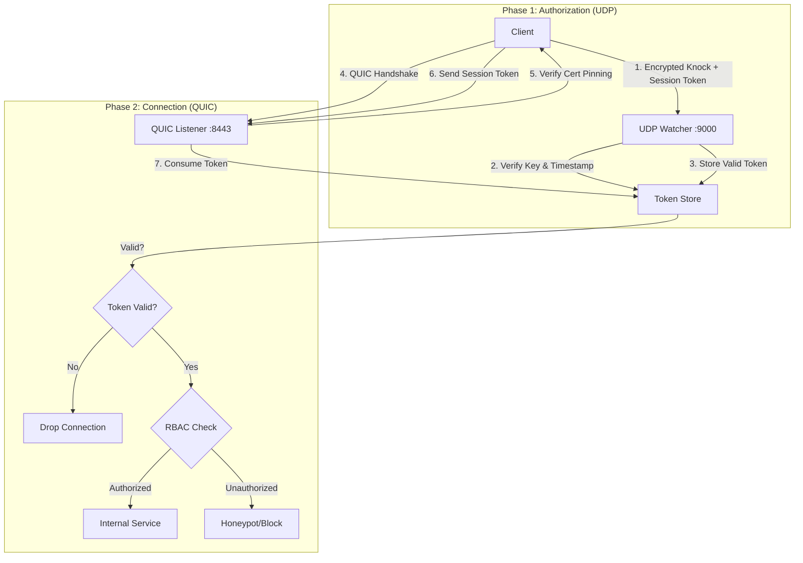

# GhostPort
> **Zero-Trust Stealth Bunker**\
> **Current Version:** v5.2 (Hardened Core + Client Profiles)\
> **Status:** Production-Ready\
> **Language:** Rust


## Overview
**GhostPort** is a specialized **Stealth Bunker** designed to protect high-value internal services (SSH, RDP, Kubernetes APIs) from the public internet. It is not a general-purpose web server; it is an invisible gateway that remains completely silent to unauthorized scans.

---

## Architecture (v5.2)



---

## Key Features

### Zero-Trust Security
*   **Single Packet Authorization (SPA):** The server ignores all traffic until it receives a valid, encrypted UDP "Knock" (Noise Protocol).
*   **Session Tokens:** Eliminates IP-based trust. Authorization is granted via a cryptographically secure, single-use token exchanged during the knock.
*   **Certificate Pinning:** Clients must verify the server's certificate fingerprint to prevent MITM attacks.
*   **Argon2 Encryption:** Private keys are encrypted at rest using the memory-hard Argon2id algorithm.

### Active Defense
*   **The Jailkeeper:** Automatically bans IPs that send invalid packets, replay attacks, or trigger the WAF.
*   **Fail-Closed Architecture:** If the service fails, it stays closed. No "fail-open" fallbacks that expose ports.
*   **Strict WAF:** Deep packet inspection for SQLi, XSS, and Traversal attacks.

### Production Ready
*   **QUIC Transport:** High-performance, encrypted data plane (HTTP/3-like) using `quinn` and `rustls`.
*   **Client Profiles:** Manage multiple environments (Prod, Staging) easily via `Client.toml`.
*   **Systemd Integration:** Includes a hardened service file for Linux deployment.

---

## Quick Start

### 1. Build
```bash
car go build --release
```

### 2. Generate Keys
```bash
# Server (Encrypted with Master Key)
cargo run -- keygen --master-key "my_secret_password"

# Client (Raw Key for local use)
cargo run -- keygen --master-key "temp"
```

### 3. Configure Server (`GhostPort.toml`)
See the **Configuration** section below for details.

### 4. Configure Client (`Client.toml`)
Create a `Client.toml` to save your connection details:
```toml
[profiles.production]
target = "1.2.3.4:8443"
knock = "1.2.3.4:9000"
local_port = 2222
server_pub = "..."
my_priv = "..."
server_cert_hash = "..." # Get this from Server logs at startup
```

### 5. Connect
```bash
# Connect using the profile
cargo run -- connect --profile production

# Or access via the local tunnel
ssh -p 2222 user@localhost
```

---

## Configuration (`GhostPort.toml`)

All rules are **Private**. This file controls the Server's behavior.

```toml
[server]
listen_ip = "0.0.0.0"
listen_port = 8443
knock_port = 9000        # UDP Port for Single Packet Authorization
tls_enabled = true
cert_path = "./certs/server.crt"
key_path = "./certs/server.key"
# DoS Protection: QUIC Resource Limits
max_concurrent_bidi_streams = 100
max_idle_timeout_ms = 30000

[backend]
target_addr = "127.0.0.1:22" # The hidden service to protect
target_host = "localhost"

[security]
# Encrypted Private Key (Base64).
# Generated via `ghostport keygen --master-key <SECRET>`.
# Server requires `GHOSTPORT_MASTER_KEY=<SECRET>` env var to decrypt this at startup.
encrypted_private_key = "..." 
session_timeout = 30
enable_deep_analysis = true

[security.ban]
enabled = true
ban_duration = 3600      # Ban duration in seconds (1 Hour)
max_violations = 3       # Strikes before ban

[[users]]
username = "admin"
roles = ["superadmin"]
public_key = "..."       # Client's Public Key (Base64)

[[rules]]
path = "/"
allowed_roles = ["superadmin"]
on_fail = "honeypot"     # Actions: "block" or "honeypot"
```

---

## Deployment (Systemd)

1. Copy binary to `/opt/ghostport/`.
2. Copy `ghostport.service` to `/etc/systemd/system/`.
3. Update paths and `GHOSTPORT_MASTER_KEY` in the service file.
4. Enable and start:
   ```bash
   systemctl enable --now ghostport
   ```
