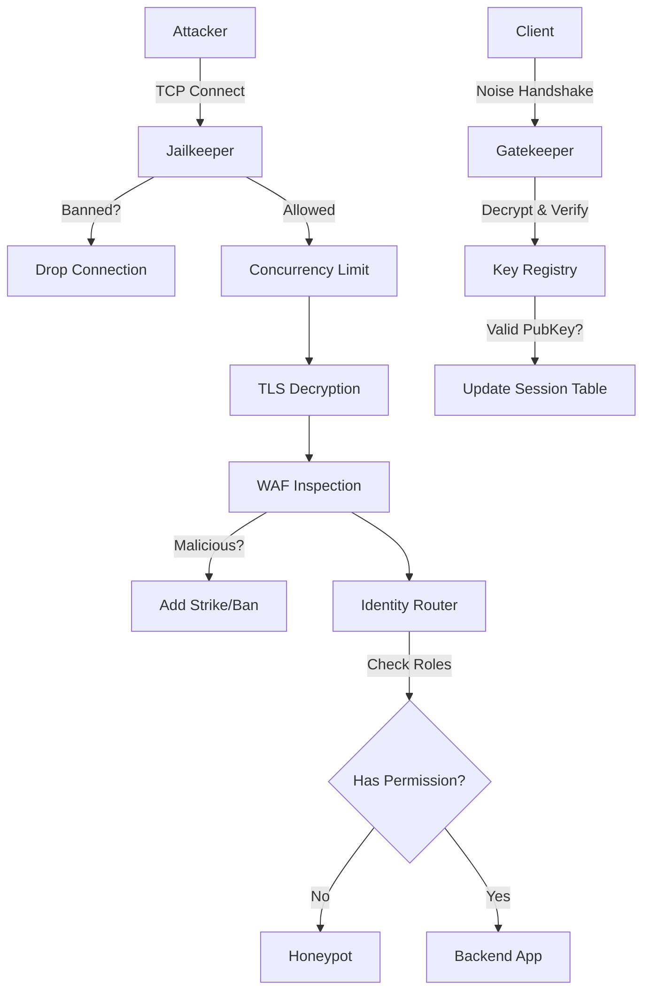

# GhostPort
> **Zero-Trust Identity Aware Proxy**\
> **Current Version:** v4.0 (Crypto-Identity Edition)\
> **Status:** Production-Ready Core / Pre-UI\
> **Language:** Rust


## Overview
**GhostPort** is a high-performance, security-focused Reverse Proxy designed to protect internal services from the public internet. Unlike standard proxies (Nginx/HAProxy), GhostPort operates on a **Zero-Trust** model. It assumes all traffic is hostile until proven otherwise.

It combines the features of a **Firewall** (SPA/Port Knocking), a **WAF** (Web Application Firewall), an **IDS** (Intrusion Detection/Honeypot), and an **IAM** (Identity Access Management) system into a single, dependency-free binary.

---

## Architecture (v4.0)
GhostPort operates using a "Defense in Depth" pipeline. Traffic must pass through multiple security layers before reaching the backend.



### Key Modules
* **`src/main.rs`**: The Orchestrator. Manages the TCP/UDP threads and shared state.
* **`src/knocker.rs`**: **(New in v4.0)** The Client. Initiates a `Noise_IK_25519_ChaChaPoly_BLAKE2s` handshake.
* **`src/udp.rs`**: The Listener. Acts as a Noise Responder. Silently drops any packet that cannot be decrypted with the Server's Private Key.
* **`src/crypto.rs`**: **(New in v4.0)** Handles the symmetric encryption (`ChaCha20Poly1305`) of the Server's configuration secrets.
* **`src/auth.rs`**: **(Updated in v4.0)** Maps Client Public Keys to Roles (e.g., `admin`, `dev`) instead of TOTP codes.
* **`src/jail.rs`**: **(New in v2.1)** Active Defense. Instantly drops connections from banned IPs before they consume resources.
* **`src/router.rs`**: Role-Based Access Control (RBAC). Checks if the authenticated user has the required roles (e.g., `["admin"]`) for the requested path.
* **`src/waf.rs`**: Regex-based inspection engine to block SQLi, XSS, and Traversal attacks.
* **`src/honeypot.rs`**: Interactive deception module. Serves fake login pages to capture attacker credentials and monitor attackers.

---

## Version History & Changelog

### **v4.0: Crypto-Identity Edition (Current)**
* **Feature:** **Noise Protocol Integration**. Replaced TOTP/String knocks with a cryptographically secure handshake (`Noise_IK_25519_ChaChaPoly_BLAKE2s`).
* **Feature:** **Mutual Authentication**. Both Client and Server verify each other's identities using static public keys.
* **Feature:** **Encrypted Configuration**. The Server's Private Key is stored as an encrypted blob on disk, decrypted only at runtime via Environment Variable.
* **Feature:** **New CLI**. Added `knock` (client) and `keygen` (utility) commands.
* **Security:** **Zero Plaintext Secrets**. No sensitive keys exist in plaintext within `GhostPort.toml`.

### **v3.0: Identity & Access Management**
* **Feature:** **TOTP Integration**. Static passwords replaced with Time-based One-Time Passwords.
* **Feature:** **Replay Protection**. Codes are "burned" immediately after use. Sniffing a packet is now useless to an attacker.
* **Feature:** **RBAC (Role-Based Access Control)**. Users have multiple roles (e.g., `dev`, `admin`). Endpoints enforce specific role requirements.
* **Logic:** Moved from "IP-based Trust" to "Identity-based Trust".

### **v2.1: The Hardened Edition**
* **Feature:** **The Jailkeeper**. An active ban system. 3 Strikes = 1 Hour Ban (default numbers).
* **Feature:** **DoS Protection**.
* **Slowloris:** Enforced 5-second timeouts on HTTP headers.
* **Connection Floods:** Added Semaphore to limit max concurrent connections (Default: 1000).
* **Fix:** WAF now URL-decodes payloads (handling `%27` vs `'`) before inspection.

### **v2.0: The Security Gateway**
* **Feature:** **Single Packet Authorization (SPA)**. Services are invisible until a UDP packet is received.
* **Feature:** **Configuration System**. Added `GhostPort.toml` for hot-swappable settings.
* **Feature:** **Honeypot**. First implementation of the fake admin panel.
* **Feature:** **Webhooks**. Integration with Discord/Slack for real-time alerts.

### **v1.0: The Prototype**
* **Feature:** Basic TCP Proxying using `tokio::io::copy_bidirectional`.
* **Feature:** HTTP Header Parsing.
* **Feature:** Host Header Spoofing (Virtual Host routing).

---

## Configuration (`GhostPort.toml`)
The system is fully driven by this configuration file.

```toml
[server]
listen_ip = "0.0.0.0"
listen_port = 8443
tls_enabled = true
cert_path = "./certs/server.crt"
key_path = "./certs/server.key"
max_connections = 1000

[backend]
target_addr = "127.0.0.1:8080"
target_host = "myapp.local"

[security]
enable_deep_analysis = true
session_timeout = 300
# The Server's Private Key (Encrypted with your Master Password)
# Run `ghostport keygen --master-key "secret"` to generate.
encrypted_private_key = "REPLACE_WITH_GENERATED_ENCRYPTED_KEY"

[security.ban]
enabled = true
ban_duration = 3600
max_violations = 3

# --- USERS ---
# Map Client Public Keys to Identity & Roles

[[users]]
username = "user_admin"
roles = ["superadmin", "dev"]
# The Client's Public Key (Base64)
public_key = "REPLACE_WITH_CLIENT_PUBLIC_KEY"

[[users]]
username = "bob"
roles = ["auditor"]
public_key = "REPLACE_WITH_CLIENT_PUBLIC_KEY_2"

# --- ROUTING RULES ---

# Rule 1: The Fortress (Only SuperAdmins)
[[rules]]
path = "/admin"
type = "private"
allowed_roles = ["superadmin"]
on_fail = "honeypot"

# Rule 2: The Logs (Auditors AND SuperAdmins)
[[rules]]
path = "/logs"
type = "private"
allowed_roles = ["superadmin", "auditor"]
on_fail = "block"

# Rule 3: Public
[[rules]]
path = "/"
type = "public"
strict_waf = true
on_fail = "block"

[reporting]
webhook_url = "https://discord.com/api/webhooks/12345/abcde"
log_all_requests = false
```

---

## How to Run

### Prerequisites
1. **Rust Toolchain:** `curl --proto '=https' --tlsv1.2 -sSf https://sh.rustup.rs | sh`
2. **Generate Certs (Local):**
```bash
openssl req -x509 -newkey rsa:4096 -keyout key.pem -out cert.pem -days 365 -nodes
```

### 1. Installation & Build
```bash
# Clone and Build
git clone https://github.com/MadCoder/GhostPort.git
cd GhostPort/ghostport
cargo build --release
```

### 2. Generate Identities
GhostPort v4.0 uses **Mutual Authentication**. Both the Server and the Client need their own Keypairs.

**Step A: Generate Server Keys**
```bash
# Replace 'my_secret' with a strong master password
cargo run -- keygen --master-key "my_secret"
```
*Output:*
1.  **Encrypted Private Key**: Copy this to `GhostPort.toml` under `[security]`.
2.  **Public Key**: Save this. You will give this to your Clients (`SERVER_PUB`).

**Step B: Generate Client Keys**
```bash
cargo run -- keygen --master-key "temp" 
```
*Output:*
1.  **Public Key**: Copy this to `GhostPort.toml` under `[[users]]`.
2.  **Raw Private Key**: Save this securely. The Client needs this to knock (`CLIENT_PRIV`).

### 3. Running the Server
You must provide the Master Key environment variable to decrypt the config at runtime.
```bash
# 1. Start your backend (e.g., a python server)
python3 -m http.server 8080 &

# 2. Run GhostPort Server
export GHOSTPORT_MASTER_KEY="my_secret"
cargo run -- server
```

### 4. Authenticating (The "Knock")
Standard tools like `nc` or `telnet` **cannot** be used anymore because the packets are encrypted. Use the built-in `knock` command.

```bash
cargo run -- knock \
  --server "127.0.0.1:9000" \
  --server-pub "<SERVER_PUB>" \
  --my-priv "<CLIENT_PRIV>"
```
*If successful, the Server logs will show: `Authorized Noise Session: user_admin`*

---

## The "Invisible Server" Philosophy
GhostPort is designed to be completely invisible to port scanners (e.g., Shodan, Nmap). 
By default, **ALL TCP connections are dropped** unless the source IP has successfully "knocked" via UDP.

**There are no "Open Ports".**

### How to serve Public Pages?
If you have an application that needs to expose a public route (e.g., a mobile app login screen or a status page), you should use the **"Guest Identity"** tactic:

1.  Generate a standard Client Keypair using `ghostport keygen`.
2.  Register the Public Key in `GhostPort.toml` with **no special roles** (e.g., `roles = ["guest"]` or empty).
3.  Embed the corresponding Private Key into your application (mobile app, frontend server, etc.).
4.  Configure the application to send a "Knock" packet before attempting to connect.

This ensures that:
1.  Your server remains invisible to the general public and scanners.
2.  Only your specific application (which holds the guest key) can even *see* that port 8443 is open.
3.  Once connected, the `router.rs` will restrict this user to only `type = "public"` paths.

---

## Future Roadmap
* **Phase 6 (Next):** **"Mission Control" Dashboard**. A TUI (Terminal User Interface) built with `ratatui` to visualize active sessions, banned IPs, and live attacks in real-time.
* **Phase 7:** Distributed State (Redis) for multi-server clusters.
* **Phase 8:** ACME Integration (Auto-Let's Encrypt).
